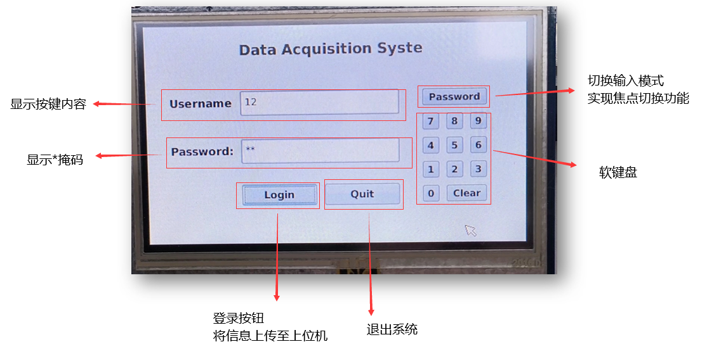
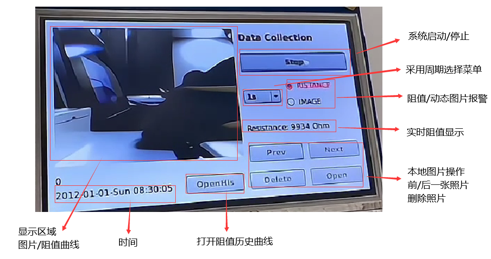

# Data-Collection-System

一个基于 ITOP-4412 的数据采集监控系统设计

## 安装

操作系统: `ubuntu20.04`，编译器：`gcc`、`arm-linux-gcc`，开发平台：`QT`，下位机：`ITOP-4412`.

配置：
``` bash
sudo apt-get install gcc lib32stdc++6 lib32z1 
sudo mkdir /usr/local/arm   #创建存放arm-linux-gcc的文件夹
sudo chmod 777 /usr/local/arm   #开放读写权限 
cp arm-linux-gcc-4.3.2.tar.gz /usr/local/arm    #拷贝到刚创建的目录中
cd /usr/local/arm 
tar -xvf arm-linux-gcc-4.3.2.tar.gz #解压刚拷贝的压缩文件 
vim ~/.bashrc #修改环境变量
o   #进入编辑器后按 o/insert 进行插入修改
PATH=$PATH:/usr/local/arm/4.3.2/bin #添加arm-linux-gcc路径
Esc & :wq   #退出修改模式并保存）
source ~/.bashrc    #使修改的环境变量生效
arm[TAB][TAB]   #检查是否安装arm-linux-gcc成功
```


## 系统功能模块设计

#### 整体流程图：


### 一、数据采集模块

- 下位机每 0.5 秒采集电阻数据和摄像头图像  
- 采集周期可以通过下位机的图形界面设置  
- 图像动态监测功能，具体如下：  
    -  通过图像检测到物体出现/消失时，向上位机上传图片，否则只在下位机本地存储  
    - 在下位机 GUI 上设置报警控件，如果检测到物体出现/消失则变色


### 二、数据通讯模块

- 双向数据通讯，上位机接收到来自下位机的一帧数据信息后，向下位机反馈接收结果（错误码或者文字信息），下位机可以通过 GUI 呈现来自上位机的反馈信息   
- 通讯保活功能（心跳包），具体如下： 
  - 每 1 秒钟，上位机向下位机发送信息，要求下位机反馈
  - 下位机收到要求反馈的信息后，反馈到上位机
  - 上位机设置接收下位机反馈的超时时长，如果连续三次在时长内没有收到来自下位机的反馈信息，则在上位机的 GUI 上呈现通讯故障的提示信息


### 三、本地监控界面

- 在下位机的触摸屏上显示阻值、图片和阻值报警信息
- 记录查询功能，具体如下： 
  - 可以在 GUI 上呈现阻值历史曲线
  - 可以查看摄像头拍摄得到的图片列表
- GUI 设计 
  - 下位机登录界面
    - 密码输入框要求使用掩码（*号）
    - 可以通过 GUI 呈现登录失败信息
  - 用于输入密码的软键盘


### 四、上位机监控界面

-  在上位机的 GUI 上呈现实时更新的阻值、图片和阻值报警信息 
- 记录查询功能，具体如下：
  - 可以在 GUI 上呈现阻值历史曲线
  - 可以查看从下位机接收的图片列表
  - 可以显示下位机的连接状态（无连接、在线、掉线）
- GUI 设计 
  - 上位机的登录界面
  - 支持下位机的用户管理功能，包括用户添加、删除、修改密码


## 结果显示
#### 1.登陆界面


#### 2.下位机界面


#### 3.动态图像监测


#### 4.上位机界面


## P.S.
本项目基于东南大学自动化学院嵌入式系统设计课程大作业开发。
